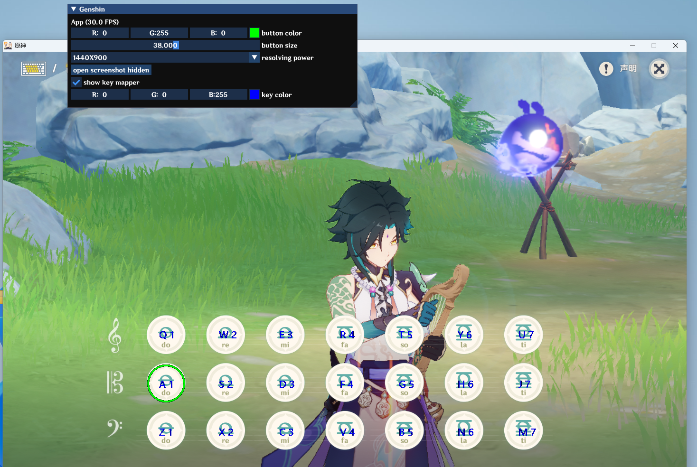

# Genshin Impact Piano 

[English](https://github.com/Chener-03/GenshinPiano/blob/master/README.en.md)

#### 介绍  
帮助你在原神游戏中自动演奏的脚本,包含单步演奏,按键提示等

乐谱会陆续上传到服务端,软件中可直接演奏,无需单独下载乐谱

乐谱均来自全网收集并标注出处,如有侵权请联系作者下架

新功能不断开发,敬请期待

更多请查看 http://chener.xyz:8966

#### 说明
1. 模拟按键为驱动层
2. 按键提示为透明窗口覆盖提示,绝不修改游戏内存,可放心使用
3. 详细使用说明请查阅官网

#### 截图

